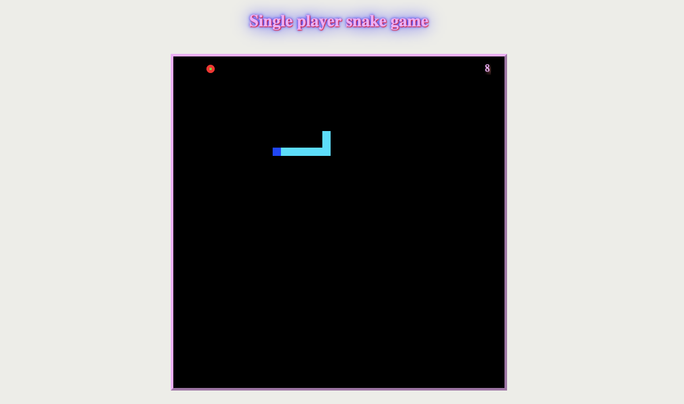

# phaser-snake
A simple snake game using Phaser! You can modify it based on your preferences :)
## How to use:
- clone the project
- run `npm i`
- run `node index.js` or `nodemon index.js`
- have fun!
## Figures

